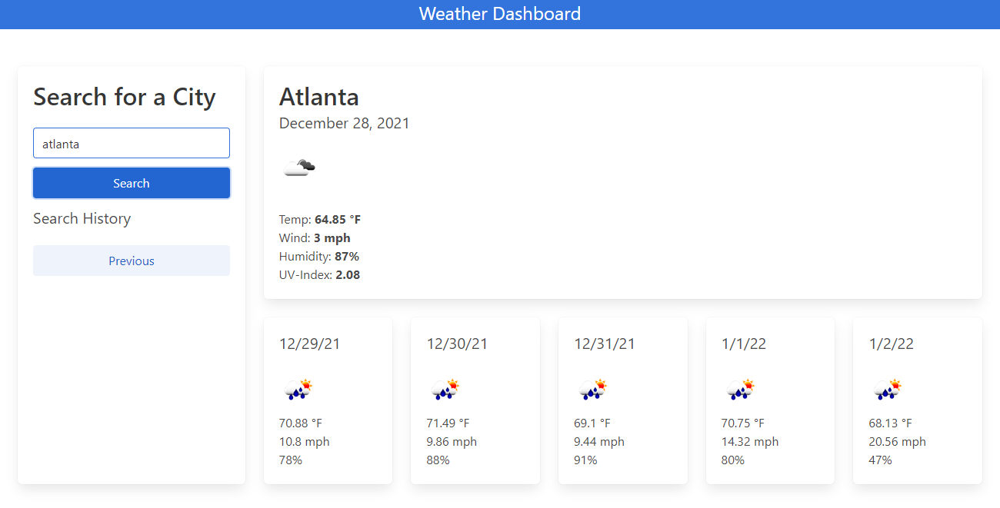

# Weather-Dashboard

This app allows the user to enter a city name and retrieve current weather as well as a 5-day forecast. It saves previous city searches and makes them available at the touch of a button.

Unfortunately, it still needs some work. The user can enter a city name and return the current city name, date, temperature, windspeed, and humidity. The weather icon and UV index are not yet included. The 5-day forecast and history are also not yet functional.

UPDATE: Current Weather now displays all components, including the weather icon and UV index, and the 5-day forecast now displays correctly. The next task is displaying previous search history as clickable buttons.

Deployed application:
https://shelleymcq.github.io/Weather-Dashboard/

Built with:
    HTML
    CSS
    Bulma CSS framework
    JavaScript
    JQuery
    APIs:
    openweathermap.org
    momentjs.com

## Comments or Questions
Email shelleymcq.dev@gmail.com
